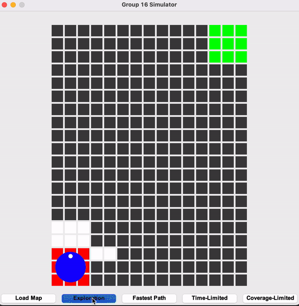
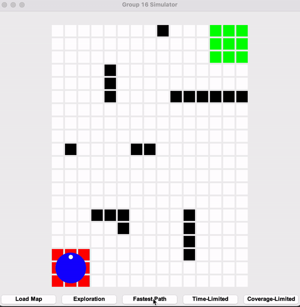

# Project-MDP-Group16

## Objective
 The objective of this project is to build an autonomous robotic system which can explore and traverse an unknown area with dimensions of 2 x 1.5 x 0.15 metres by using algorithms and hardware such as sensors.

 This autonomous system must be able to achieve the following requirements:\
 1. The robot must be able to map out the entire unknown area while recognizing trained images placed in the environment.
 2. The robot must be able to plan the fastest path from the start point to the endpoint and navigate to the goal point in the shortest amount of time while avoiding collisions with any obstacles placed in the area. 
 3. Lastly, the robot must have a seamless communication of control signals and logic between the Android, Algorithm and Image Recognition components to and from the Raspberry Pi (RPI), which acts as the central logic control of the entire system.

## Algorithm
2 important algorithms implemented in this project were: \
- `Exploration` 
    - The robot must be able to traverse the unknown area and map the environment accurately. The robot must also take into consideration of its simulated mounted sensors during the `Exploration` process.
    - Robot must end its `Exploration` process from where it started from.
- `Fastest Path`
    - A* Algorithm along side with weighted manhattan heuristic were used in the implementation of `Fastest Path` algorithm.
    - Robot must take the `Fastest Path` from `start` to designated `goal` zone.

#### Exploration

#### Fastest Path

#### Live Video

